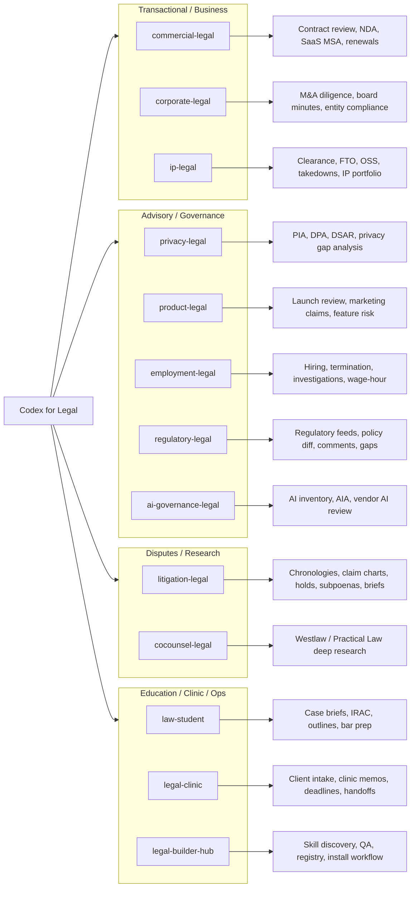

# Codex for Legal Practice Area Map

This map shows the public practice-area structure of `codex-for-legal`: 13 Codex legal plugins grouped by use case, with a short summary of what each plugin is for.

