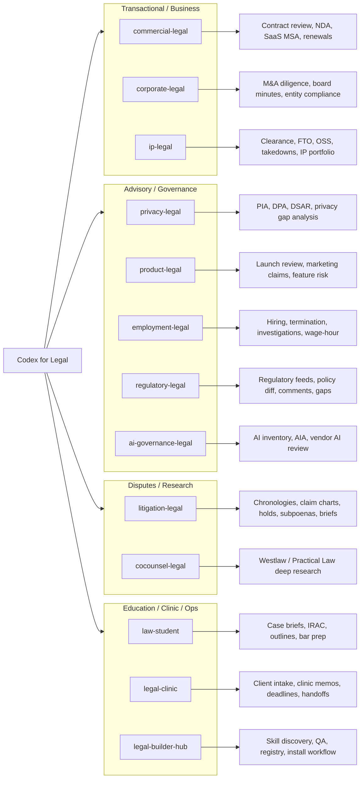

# Codex for Legal

This repository migrates Anthropic's [`claude-for-legal`](https://github.com/anthropics/claude-for-legal) Claude plugin suite into a Codex repo-scoped plugin marketplace.

Codex migration and adaptation by Alexander C. H. Lou. Upstream legal workflow content remains attributed to Anthropic and Thomson Reuters where applicable.

This is an unofficial adaptation. It is not affiliated with, endorsed by, or sponsored by Anthropic, Thomson Reuters, or OpenAI.

## What Is Included

- 13 Codex plugins under `plugins/`.
- 151 migrated legal skills using the standard `skills/<skill>/SKILL.md` layout.
- Repo marketplace metadata at `.agents/plugins/marketplace.json`.
- Upstream MCP connector lists archived under each plugin's `references/mcp/` directory for reference only.
- Playbook templates under `config/templates/codex-for-legal/`.
- License and attribution notes in `LICENSE`, `NOTICE`, and `MODIFICATIONS.md`.

## Practice Area Map



See `KNOWLEDGE_GRAPH.md` for the standalone version.

## Codex Setup

Recommended public install:

```bash
codex plugin marketplace add alexchlou/codex-for-legal
```

Restart Codex, open the Plugin Directory, select the `Codex for Legal` marketplace, and install the practice-area plugins you need.

To refresh a Git-backed install:

```bash
codex plugin marketplace upgrade codex-for-legal
```

For local development from a clone, run this from the repository root:

```bash
codex plugin marketplace add .
```

Local-path installs are not Git-backed, so `upgrade` does not apply to them. Use the public install command above if you want Codex to update from GitHub.

## Local Legal Configuration

Before using a practice-specific review workflow, copy the relevant template:

```bash
mkdir -p config/local/codex-for-legal/commercial-legal
cp config/templates/codex-for-legal/commercial-legal/CLAUDE.md \
  config/local/codex-for-legal/commercial-legal/CLAUDE.md
```

Customize the local copy with your house style, playbook, approval matrix, and review preferences. `config/local/` is ignored by git.

## Connector Policy for v1

This migration is local-file first. References to Drive, CLM IDs, Slack, Westlaw, iManage, Ironclad, eDiscovery, dockets, or other remote systems require separately configured Codex MCP servers or connectors. Until those are configured, provide local files, local exports, or pasted excerpts.

## Legal Use

These skills support legal workflows but do not replace attorney review. Treat generated work product as draft analysis requiring supervision, source checking, and jurisdiction-specific validation.
